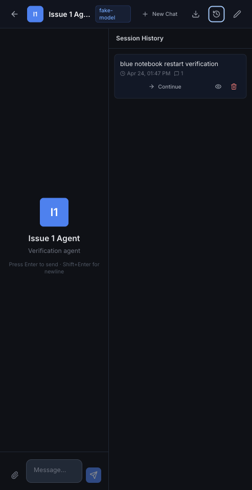
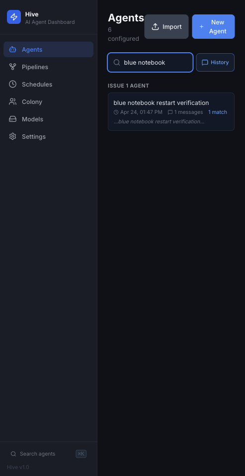
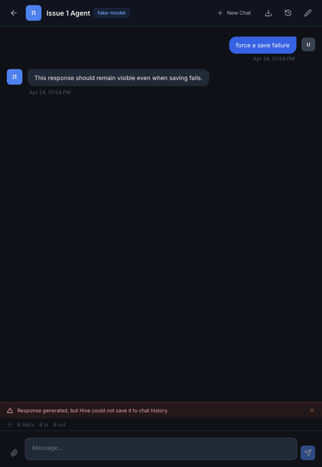

## What was built

- Fixed chat session persistence to write to each agent's configured workspace, matching the reader/search path.
- Replaced swallowed session save failures with server-side contextual logging and a client-visible save warning.
- Added backend coverage for session creation, loading, deleting, renaming, global search, unknown-agent failures, and websocket session serialization.
- Added lifecycle artifacts and visual verification evidence for issue #1.

## Verification evidence

| Check | Result | Evidence |
| --- | --- | --- |
| Backend suite | Passed: 74 tests, 0 failures | `npm test` |
| Client tests | Passed: 31 tests, 0 failures | `npm run test:client` |
| Touched chat file lint | 0 errors, 1 existing warning | `./node_modules/.bin/eslint src/components/chat/ChatWindow.jsx` |
| Full client lint | Known existing repo-wide failures remain outside this issue | `npm run lint --prefix client` |
| Restart persistence | Saved session survived API restart and was returned by session API | `curl -s http://127.0.0.1:3001/api/sessions/issue1-agent` |

## Screenshots

## Deviations from PLAN.md

- The normal `npm run dev` verification path hit environment-specific watcher/listener limits, so visual verification used `node server/index.js` and `vite --host 127.0.0.1` against a throwaway `/tmp` database.
- Route tests avoid Supertest's temporary listener because the sandbox blocks ephemeral listeners unless elevated; the handlers are exercised directly and the full backend suite was verified with local-listener permission.
- The `codex/...` branch prefix could not be created in this local Git environment, so the branch is `codex-issue-1-session-reliability`.
- Full client lint is not clean because of unrelated existing lint debt elsewhere in the client; touched chat-file lint is clean except for one pre-existing hook dependency warning.

## Issue

Closes #1

Branch: `codex-issue-1-session-reliability`

## Manual review request

@SantiaGoMode please perform the final manual code and UI review.
