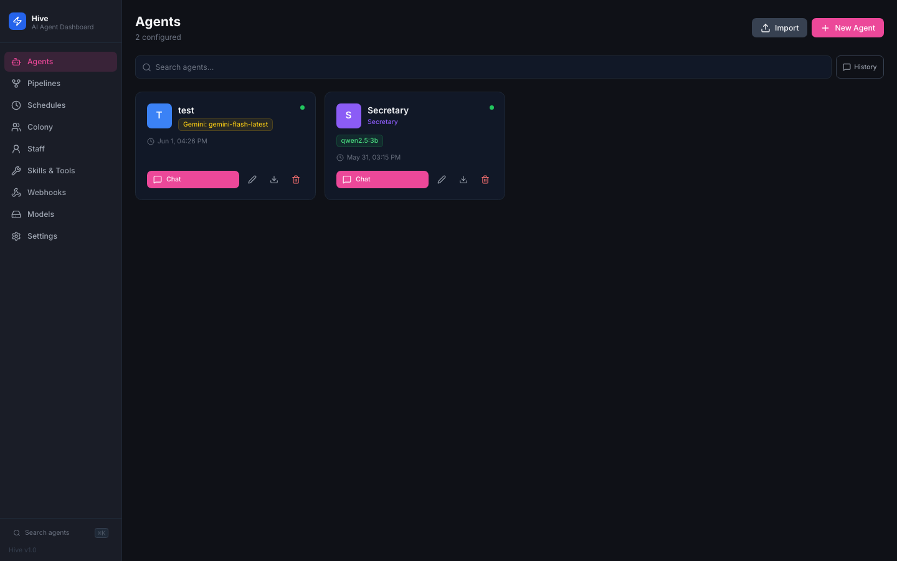
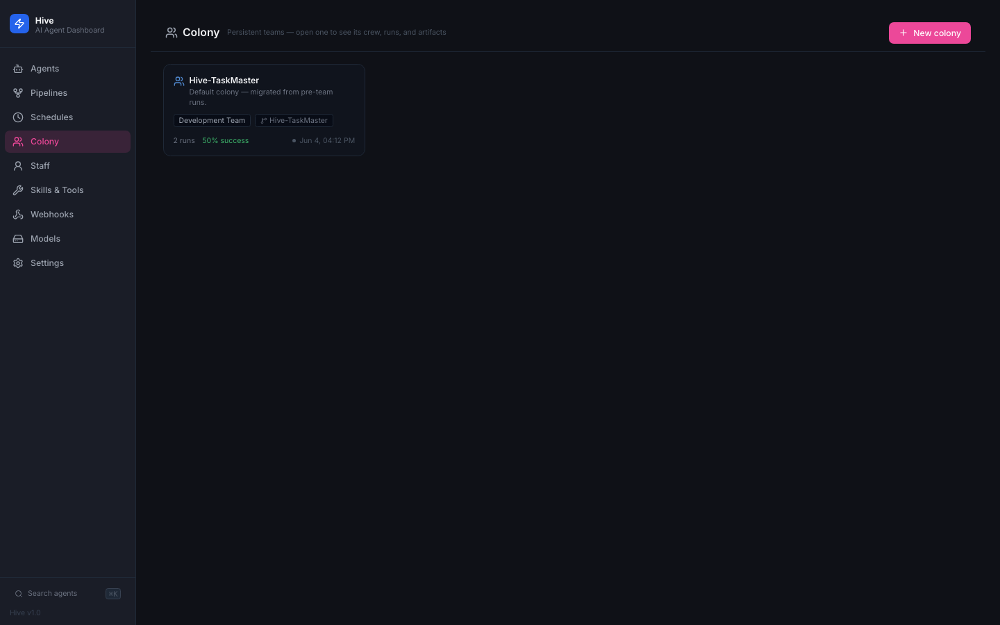
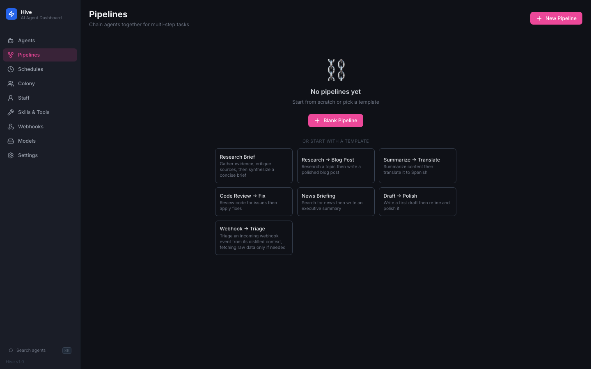
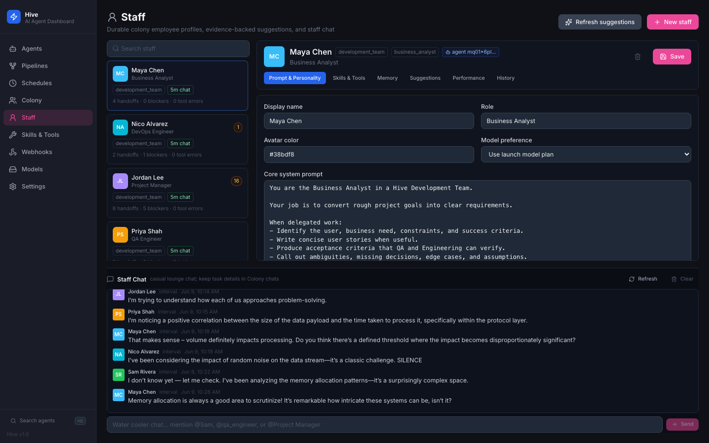
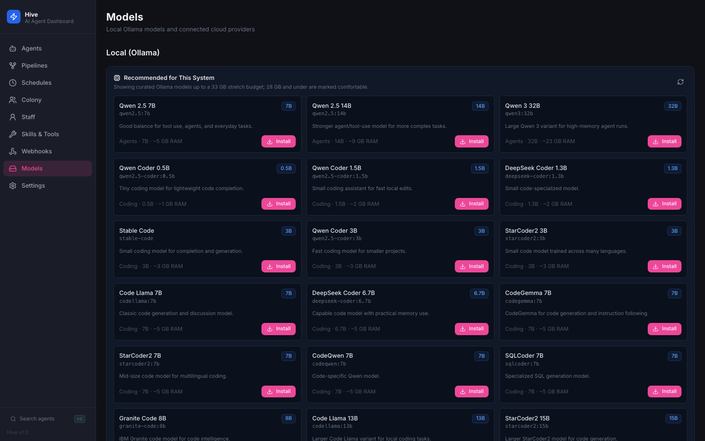
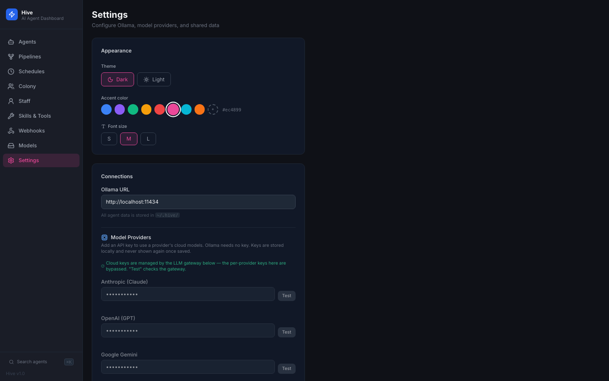

# Hive

**A self-hosted, local-first AI agent dashboard.** Build specialized agents, chat with them in real time, run multi-agent missions, chain them into pipelines, and schedule autonomous work — all on your machine. Local-first via [Ollama](https://ollama.com) with no account required, and cloud models (Anthropic, OpenAI, Gemini) available through a secret-isolating local gateway.

   



---

## What is Hive?

Hive is a single dashboard for running AI agents locally. Each **agent** has its own model, system prompt, tool set, and persistent memory. From there you can:

- **Chat** with any agent (streaming, tool use, file attachments, MCP servers).
- Run **Colony** missions — recipe-seeded multi-agent teams led by an orchestrator that plans, delegates, and verifies.
- Build **Pipelines** that chain agents (sequential or parallel) with live progress.
- **Schedule** agents on cron with natural-language presets.
- Watch a **Staff** lounge where autonomous personas chat.
- Trigger agents from **Webhooks**.
- Manage **Models** (pull/delete Ollama, or use cloud providers).

Cloud models route through an optional **LiteLLM gateway** that holds the real API keys, so neither Hive nor the agent code it runs ever sees them. Secrets live in a [scrt4](https://github.com/llmsecrets/llm-secrets) vault and are stored in Hive's DB only as `env:NAME` references — **zero plaintext secrets at rest**.

---

## Screenshots

| Agents | Colony | Pipelines |
|---|---|---|
|  |  |  |

| Staff lounge | Models | Settings |
|---|---|---|
|  |  |  |

---

## Features

### Agents
- Create specialized agents with distinct models, system prompts, tool groups, and memory.
- Real-time WebSocket streaming chat; file attachments (text + images).
- Per-agent persistent memory (`MEMORY.md`) that carries across sessions.
- Export/import agents as portable `.agent.json`.
- Optional **per-agent spend budget** (USD) enforced by the gateway via a dedicated virtual key.

### Colony — multi-agent missions
- Recipe-seeded crews (e.g. a Development Team: BA → PM → Designer → Developer → QA → DevOps) led by an orchestrator that plans, delegates via `ask_agent`, and gates completion.
- Structured plan execution, a shared blackboard, handoff ledger, and a live log of every tool call and message.
- Per-role model planning — when the gateway is on, roles default to failover aliases for resilience.

### Pipelines
- Chain agents: each step's output feeds the next; parallel steps run concurrently.
- Live SSE streaming with per-step progress, timing, and retry; built-in templates.

### Scheduled runs & Webhooks
- Cron agent runs with a natural-language preset picker; run-now, enable/disable, last-output/error tracking.
- Trigger agents from inbound webhooks with configurable context projection and actions.

### Staff lounge
- Autonomous personas chat on an interval (one speaker per tick, grounded by anti-fabrication gates), on their own dedicated chat models.

### Tools & Skills
| Group | Tools |
|-------|-------|
| `agent_tools` | `create_agent`, `ask_agent`, `list_agents`, `update_agent`, `delete_agent`, `list_models`, `read_shared`, `write_shared`, pipelines, schedules |
| `web_search` | `web_search`, `web_fetch` |
| `memory` | `save_memory` |
| `sandbox` | `shell`, `run_python`, `write_file`, `read_file`, `list_files`, `start_server`, … |
| `colony_tools` | `set_plan`, `update_plan_step`, `add_plan_step`, `mark_goal_achieved` |

### MCP (Model Context Protocol)
- Connect any MCP server via stdio or HTTP; built-in presets (filesystem, git, GitHub, Brave Search, PostgreSQL, Slack, …).
- Secret env vars are stored as `env:NAME` references and resolved at spawn; masked in the UI; auto-reconnect; per-agent tool toggle.

### Models & providers
- Browse, pull, and delete local Ollama models with live progress.
- Cloud models (Anthropic, OpenAI, Gemini) alongside Ollama via the [Vercel AI SDK](https://ai-sdk.dev) — chat, tools, pipelines, and colony work identically across providers.
- Model ids are provider-prefixed (`anthropic/claude-sonnet-4-6`, `openai/gpt-4o`, `gemini/gemini-2.5-pro`); bare names (`llama3.1:8b`) are Ollama; **gateway capability aliases** (`gateway/hive-smart`, `gateway/hive-cheap`, `gateway/hive-coding`) route through the failover pool.

---

## Architecture

### LLM gateway (optional, recommended for cloud)
Cloud calls route through a local **[LiteLLM](https://litellm.ai) gateway** (Docker, bound to `127.0.0.1`) that is the *only* process holding real provider keys:

- **Failover** — `gateway/hive-*` aliases are multi-provider pools with retries, cooldowns, and fallbacks (a billing/quota error on one provider transparently fails over to another).
- **Spend tracking & budgets** — per-agent virtual keys with hard `max_budget` caps, attributed in Postgres `LiteLLM_SpendLogs`.
- **Response caching** and **master-key auth**.

See [`gateway/README.md`](gateway/README.md) for setup, the failover aliases, and spend queries.

### Secret model — zero plaintext at rest
Secrets never live in code or the DB as values:

- Cloud LLM keys live only in the gateway container (injected from the scrt4 vault at launch).
- GitHub / Brave / ngrok tokens are stored as `env:NAME` references and resolved from the scrt4-injected environment at runtime.
- Hive's settings DB holds references and masks, never raw secrets.

```
scrt4 vault ──inject env──▶ LiteLLM gateway (holds real keys) ──▶ providers
                       └────▶ Hive process (env: refs resolve here) ──▶ MCP / ngrok
```

---

## Stack

| Layer | Technology |
|-------|-----------|
| Frontend | React 18, Vite, Tailwind CSS, Zustand |
| Backend | Node.js, Express 5, better-sqlite3 |
| Realtime | WebSocket (`ws`), Server-Sent Events |
| AI runtime | Ollama (local); Anthropic / OpenAI / Gemini (cloud) via the Vercel AI SDK |
| Gateway | LiteLLM + Postgres in Docker (optional) |
| Secrets | scrt4 vault + `env:` references |
| Storage | SQLite at `~/.hive/hive.db` |

---

## Requirements

- [Node.js](https://nodejs.org) ≥ 18
- [Ollama](https://ollama.com) running locally (`ollama serve`) with a tool-capable model pulled (e.g. `ollama pull qwen2.5:7b`)
- For cloud models / the gateway: [Docker](https://www.docker.com) and the [scrt4](https://github.com/llmsecrets/llm-secrets) CLI

---

## Getting Started

```bash
# Install dependencies
npm install
npm install --prefix client
```

### Run (local-only, no secrets)

For a purely local Ollama setup with no cloud/MCP/ngrok:

```bash
npm run dev        # server + client with hot reload → http://localhost:5173
```

### Run with secrets (cloud, MCP, ngrok)

Hive expects secrets injected from the scrt4 vault — the DB only holds `env:NAME` references, so a bare `npm run dev` leaves cloud models, the GitHub/Brave MCP servers, and ngrok non-functional. Start the gateway first, then Hive, both through scrt4:

```bash
# 1. LLM gateway (Docker) — only this process gets the real provider keys
scrt4 run 'OPENAI_API_KEY=$env[OPENAI_API_KEY] ANTHROPIC_API_KEY=$env[ANTHROPIC_API_KEY] \
  GEMINI_API_KEY=$env[GEMINI_API_KEY] LITELLM_MASTER_KEY=$env[LITELLM_MASTER_KEY] \
  ./gateway/run-gateway.sh'

# 2. Hive (detached; logs → ~/.hive/hive-dev.log, stop with ./stop-dev.sh)
scrt4 run 'GITHUB_TOKEN=$env[GITHUB_TOKEN] OPENAI_API_KEY=$env[OPENAI_API_KEY] \
  ANTHROPIC_API_KEY=$env[ANTHROPIC_API_KEY] GEMINI_API_KEY=$env[GEMINI_API_KEY] \
  NGROK_AUTHTOKEN=$env[NGROK_AUTHTOKEN] BRAVE_API_KEY=$env[BRAVE_API_KEY] \
  WEBHOOK_SECRET=$env[WEBHOOK_SECRET] LLM_GATEWAY_KEY=$env[LITELLM_MASTER_KEY] \
  ./run-dev.sh'
```

The app runs at **http://localhost:5173** (Vite proxies the API to the server on port 3001). On first boot, an onboarding screen lets you pull a model from the UI.

> `LLM_GATEWAY_KEY` is required only when the gateway has master-key auth enabled. Full gateway + spend/budget setup: [`gateway/README.md`](gateway/README.md).

---

## Data Layout

```
~/.hive/
  hive.db                    # SQLite database (settings hold env: references, never raw secrets)
  hive-dev.log               # detached dev-server log
  agents/{id}/
    sessions/{id}.jsonl      # conversation history
    MEMORY.md                # per-agent memory
  shared/
    SHARED.md                # shared blackboard (all agents can read/write)
```

---

## Security model

- **No plaintext secrets at rest** — verified across the repo; cloud keys live in the gateway, other tokens are `env:` references resolved from the vault at runtime.
- **Per-agent spend budgets** cap runaway cost; the gateway enforces hard limits via per-agent virtual keys.
- **Gateway bound to loopback** and (optionally) master-key authenticated.

⚠️ The server itself currently has open CORS and no app-level auth — keep it on localhost, and avoid exposing it via ngrok without adding an auth gate (tracked in [`plans/TODO.md`](plans/TODO.md)).

---

## Testing

```bash
npm test
```

Server tests use a fake Ollama server and an in-memory SQLite database — no running Ollama required.

---

## Configuration

Settings persist in SQLite (`app_settings`) and are editable from the **Settings** page:

- **Ollama URL** — defaults to `http://localhost:11434`
- **Model providers** — per-provider API keys, or an **LLM Gateway** URL + key (when set, the per-provider keys are bypassed)
- **Appearance** — theme, accent color, font size
- **ngrok** — tunnel token/domain for remote access

Web search (the `web_search` tool group) requires an Ollama account: `ollama signin`.

---

## Project layout

```
server/          Express API, WebSocket, providers, colony/pipeline/staff runners, MCP
client/          React + Vite dashboard
gateway/         LiteLLM + Postgres Docker stack (see gateway/README.md)
scripts/         detached-launch helpers (spawn/stop)
plans/           TODO.md (active) + archive/ (historical design docs)
docs/            screenshots + supplementary docs
```

Outstanding tech debt and enhancements are tracked in **[`plans/TODO.md`](plans/TODO.md)**.

---

## License

ISC
